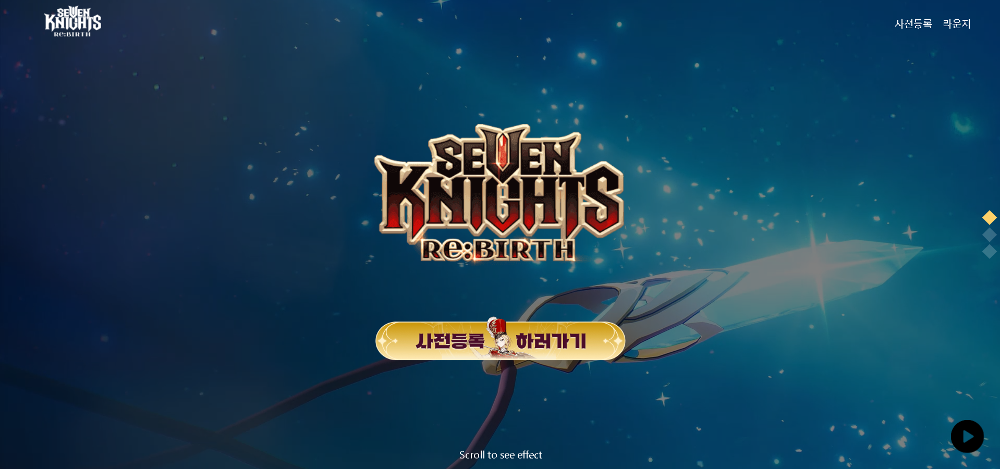

# 🐣 세븐나이츠 사전예약 사이트

**🚀 배포 링크**: [사이트 바로가기](https://stalwart-granita-3bb4c2.netlify.app/)

React를 이용하여 개발한 세븐나이츠 사전예약 페이지입니다. 이 프로젝트는 다양한 컴포넌트와 기능을 통해 사용자에게 직관적인 UI와 좋은 사용자 경험을 제공합니다. 사전예약, 등장 캐릭터 소개, 뉴스 제공, 오디오 관리 등의 기능을 구현했습니다.

 

## 컴포넌트 구성

이 프로젝트는 여러 개의 독립적인 컴포넌트로 구성되어 있으며, 각각의 역할은 다음과 같습니다:

1. Header 컴포넌트  
   페이지의 상단에 고정된 헤더로, 사이트의 로고와 중요한 링크(사전등록, 라운지 등)를 포함하고 있습니다.
2. Credit 컴포넌트  
   페이지를 처음 방문했을 때 가장 먼저 보이는 화면으로, 프로젝트와 관련된 정보를 제공합니다.

3. Character 컴포넌트
   게임의 등장 캐릭터들을 소개하는 부분입니다. 각 캐릭터는 스킬 영상과 함께 상세 페이지로 이동할 수 있는 기능을 제공합니다.

4. News 컴포넌트  
   최신 소식이나 공지사항을 사용자에게 전달하는 역할을 합니다. 주기적으로 업데이트되는 정보를 보여줍니다.

5. Side 컴포넌트
   페이지의 오디오를 관리하는 컴포넌트로, 배경음악 재생 및 관리 기능을 제공합니다.

## 주요 기능

이 페이지에서는 다음과 같은 주요 기능을 제공합니다:

- 스크롤로 페이지 구성
  페이지는 스크롤을 통해 자연스럽게 이동하며, 각 섹션(메인, 캐릭터, 뉴스 등)이 화면에 표시됩니다.

- 캐릭터 클릭으로 상세페이지 표시
  사용자가 특정 캐릭터를 클릭하면 해당 캐릭터에 대한 상세 정보가 표시되며, 캐릭터의 스킬 영상도 함께 제공됩니다.

- 무한스크롤로 영상 스크롤 관리
  캐릭터 스킬 영상은 무한스크롤로 관리되어, 사용자가 스크롤을 내리면 자동으로 새로운 영상이 나타납니다.

- 오디오 재생 관리
  페이지에서는 오디오를 다루는 사이드 바가 포함되어 있어, 사용자가 배경 음악을 켜고 끄는 등의 제어를 할 수 있습니다.

## 기술 스택

이 프로젝트는 React를 기반으로 개발되었으며, SCSS를 사용해 스타일을 관리합니다. 주요 기술 스택은 다음과 같습니다.

- React  
  컴포넌트 기반의 UI 라이브러리로, 페이지 구성 및 사용자 인터페이스를 관리합니다.
- SCSS
  스타일 관리를 위한 SCSS를 사용하여 재사용 가능한 스타일을 작성하고, 프로젝트의 디자인을 구현합니다.

- Netlify  
  배포는 Netlify를 사용하여 사이트를 호스팅하고, 빠르고 간편하게 배포를 진행했습니다.
